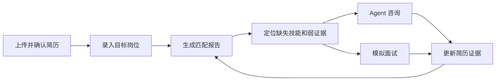
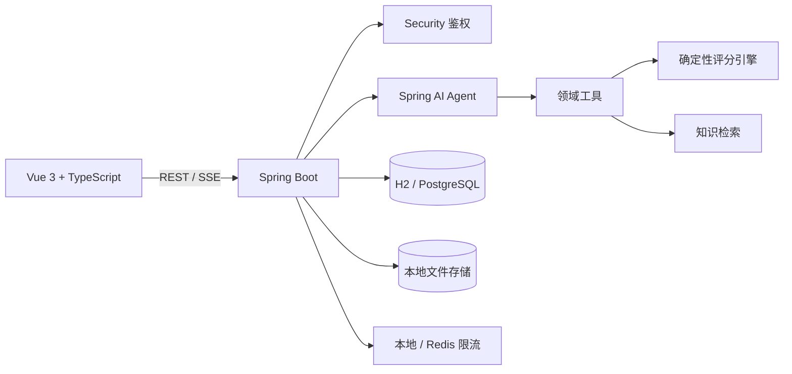

# Stepwise

> 让每一步，都有依据。

[](https://github.com/makabaka-commits/CareerAgent/actions/workflows/ci.yml)
[](https://github.com/makabaka-commits/CareerAgent/actions/workflows/public-smoke.yml)
[](LICENSE)

[在线体验](https://stepwise-app.onrender.com) · [系统架构](docs/architecture.md) · [API 文档](docs/api.md) · [部署说明](docs/deployment.md)

Stepwise 是一个面向计算机专业学生的求职准备工作台。用户可以上传简历、录入岗位 JD，查看有依据的匹配结果，并围绕技能差距继续进行 Agent 咨询和模拟面试。

系统不让大模型直接决定匹配分数。评分由可重复验证的规则引擎完成，大模型负责选择工具、组织信息和解释结果；没有配置模型时，核心流程仍然可以运行。

## 核心功能

| 功能 | 使用方式 | 实现要点 |
| --- | --- | --- |
| 账号与访客体验 | 注册、登录，或创建一次性访客工作空间 | Spring Security、BCrypt、无状态访问令牌、登录失败保护 |
| 简历管理 | 上传并解析 PDF、DOCX、Markdown 或纯文本简历 | PDFBox、Apache POI、Tesseract OCR、结构化结果人工确认 |
| 岗位管理 | 保存公司、职位和完整 JD | 从原始 JD 提取必需项与加分项，保留原文用于追溯 |
| 证据化匹配 | 查看总分、技能差距和逐项依据 | 确定性加权算法，分别计算技能覆盖、证据强度、熟练度和项目相关性 |
| 求职 Agent | 针对当前简历和岗位进行连续咨询 | Spring AI 工具调用、会话上下文、SSE 流式状态、超时降级 |
| 知识检索 | 为建议补充带来源的知识片段 | 词法混合检索、主题过滤、引用返回和提示注入过滤 |
| 模拟面试 | 按目标岗位答题并获得反馈 | 面试状态机、岗位相关题目、结构化评分与复盘建议 |

## 工作流程



## 评分是怎样得到的

每项岗位要求先按重要性加权，必需项权重为 `3`，加分项权重为 `1`。单项匹配系数由四部分组成：

```text
单项匹配 = 40% 技能覆盖 + 30% 证据强度 + 20% 熟练度适配 + 10% 项目相关性
```

未确认的技能证据会再乘以 `0.7`。最终分数表示“当前简历证据与这份 JD 的契合程度”，不是录用概率。完整规则见[评分设计](docs/scoring.md)。

## 技术架构



- **前端：** Vue 3、TypeScript、Vite、Pinia、Vue Router、Element Plus
- **后端：** Java 17、Spring Boot、Spring Security、Spring AI、Spring JDBC
- **数据：** 本地使用 H2，生产环境使用 PostgreSQL；Flyway 管理表结构
- **基础设施：** Redis 可选限流、Actuator/Prometheus 指标、Docker、Render
- **测试：** JUnit、Spring Security Test、Vitest、GitHub Actions

项目采用模块化单体结构，按鉴权、简历、岗位、匹配、Agent、检索和面试划分业务模块。这样既保留了完整后端边界，也便于在一个仓库中运行和部署。更多设计决策见[系统架构](docs/architecture.md)。

## 本地运行

### 环境要求

- Java 17 或更高版本
- Node.js 20 或更高版本
- pnpm 11
- 可选：Tesseract OCR（仅扫描版简历需要）

模型、PostgreSQL、Redis 和 Docker 都不是本地体验的必需条件。默认配置使用 H2 数据库和规则保障模式。

### 启动后端

```powershell
& .\.tools\apache-maven-3.9.16\bin\mvn.cmd -pl backend spring-boot:run
```

也可以在 IntelliJ IDEA 中直接运行 `CareerAgentApplication`。

### 启动前端

```powershell
pnpm --dir frontend install
pnpm --dir frontend dev
```

打开 `http://localhost:5173`。API 文档位于 `http://localhost:8080/swagger-ui.html`。

如果没有安装 Tesseract，将 `OCR_ENABLED` 设为 `false`；PDF、DOCX、Markdown 和纯文本简历仍可正常解析，只有扫描图片中的文字无法识别。

## 配置真实模型

模型密钥只通过环境变量提供，不要写入配置文件或提交到 GitHub。

### DeepSeek

```text
AI_PROVIDER=openai
AI_BASE_URL=https://api.deepseek.com
AI_API_KEY=<your-deepseek-api-key>
AI_CHAT_MODEL=deepseek-flash
```

### OpenAI

```text
AI_PROVIDER=openai
AI_BASE_URL=https://api.openai.com
AI_API_KEY=<your-openai-api-key>
AI_CHAT_MODEL=gpt-4.1-mini
```

`AI_PROVIDER=openai` 表示使用 Spring AI 的 OpenAI 兼容适配器。实际服务商由 `AI_BASE_URL` 决定。未配置模型时保持 `AI_PROVIDER=none`，系统会明确显示“规则保障模式”。

## 测试与质量检查

```powershell
# 后端测试
& .\.tools\apache-maven-3.9.16\bin\mvn.cmd "-Dmaven.repo.local=D:\code\CareerAgent\.tools\m2-repository" -B test

# 前端测试和生产构建
pnpm --dir frontend test
pnpm --dir frontend build
```

仓库包含两条 GitHub Actions 工作流：

- `CI`：在提交和 Pull Request 时运行后端测试、前端构建和容器构建。
- `Public smoke test`：每 6 小时及手动触发时检查公网健康接口和首页；已考虑 Render 免费实例冷启动，最多等待约 10 分钟。

## 部署

仓库根目录的 `render.yaml` 描述了 Web 服务和 PostgreSQL，可以直接部署到 Render：

[](https://render.com/deploy?repo=https://github.com/makabaka-commits/CareerAgent)

Render 免费实例可能休眠，首次访问需要等待冷启动。免费实例也没有持久文件磁盘，因此重新部署后，上传的原始简历文件可能丢失；结构化业务数据仍保存在 PostgreSQL。生产环境还应配置独立密钥、持久磁盘、备份和隐私策略。详见[部署说明](docs/deployment.md)。

## 项目结构

```text
CareerAgent/
├─ backend/             Spring Boot API 与领域逻辑
├─ frontend/            Vue 3 Web 应用
├─ docs/                架构、评分、API、部署与演示文档
├─ deploy/              Docker Compose 与云端镜像
├─ knowledge/           内置求职知识材料
├─ tests/               API 示例和测试数据
├─ .github/workflows/   CI 与公网冒烟测试
└─ render.yaml          Render Blueprint
```

## 相关文档

- [系统架构](docs/architecture.md)
- [评分设计](docs/scoring.md)
- [API 摘要](docs/api.md)
- [部署说明](docs/deployment.md)
- [演示与面试讲解](docs/demo.md)

## 当前边界

- 内置检索适合当前知识库规模，尚未接入向量数据库。
- 本地文件存储适合单机和演示环境，生产环境应替换为对象存储。
- 访客数据用于产品体验，不作为长期账号数据保存承诺。
- 项目提供求职准备辅助，不对录用结果作出预测或保证。

## License

[MIT](LICENSE)
