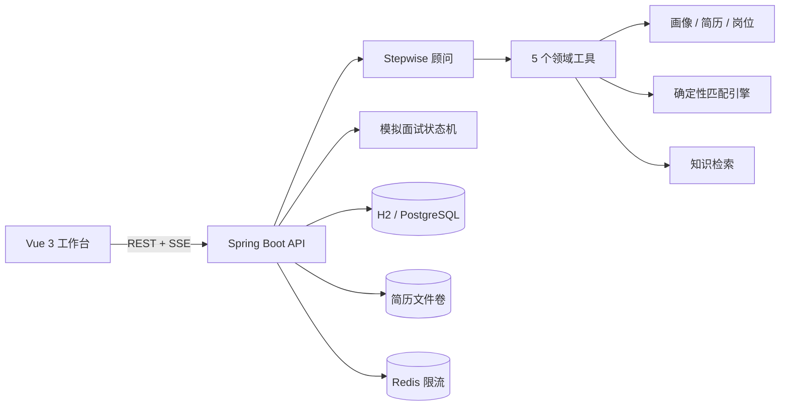
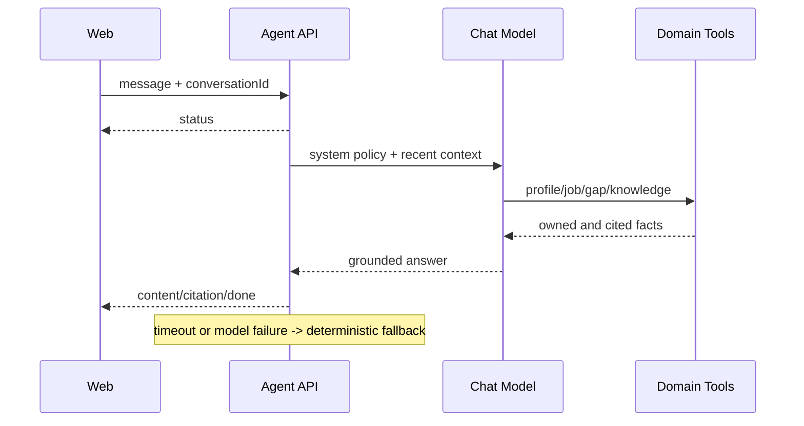

# 系统架构

Stepwise 采用模块化单体：保持毕业项目可读性，同时用端口与适配器隔离文件、状态、缓存和模型，便于后续拆分。

## Agent 请求链路

## 关键设计决策

1. 模型不直接打分，避免同一输入得到漂移结果；Java 服务是唯一评分源。
2. 外部简历、JD 和知识文档均视为不可信数据；高风险提示注入文本不会进入检索结果。
3. 所有业务资源按 `userId + resourceId` 校验，工具调用通过线程作用域绑定当前用户。
4. 本地 H2 快照让项目开箱即用；生产环境切换 PostgreSQL，Redis 负责跨实例限流。
5. 模型未配置或超时时明确降级，不伪造“AI 已分析”。

## 可继续演进

当前 RAG 是适合小型作品集的词法混合检索。数据规模增长后，可把 `KnowledgeService` 适配为 pgvector 向量召回 + BM25 重排；状态快照可进一步拆成规范化 Repository，而无需改动 Controller 或前端协议。
